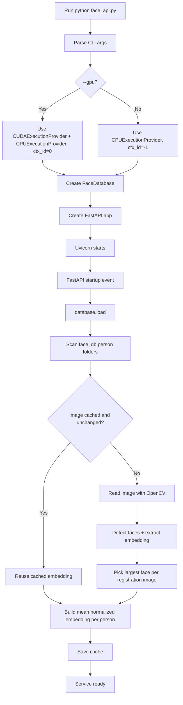
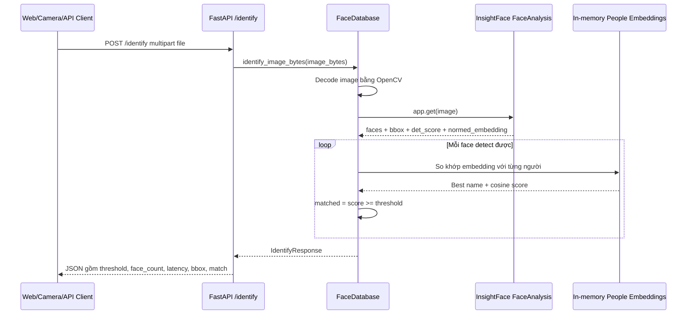
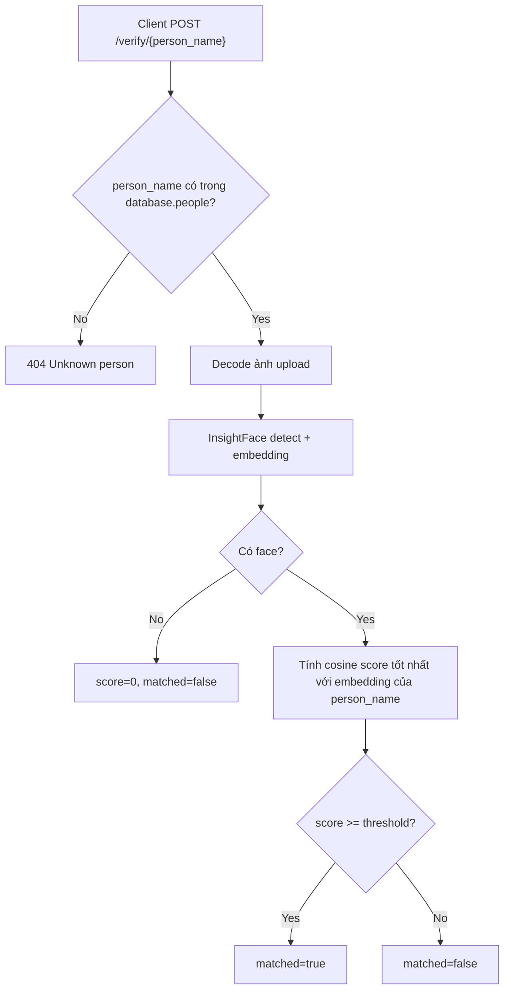
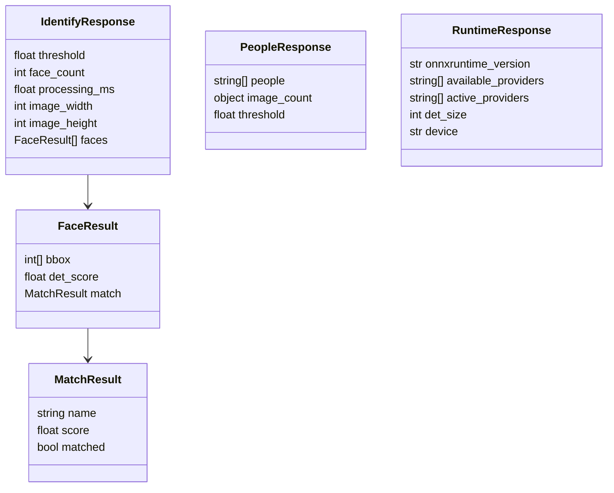

# Face API Service

Tài liệu này mô tả workflow, components và các API endpoint hiện có của service nhận diện khuôn mặt local trong repo.

## Tổng quan

Service được triển khai trong `face_api.py` bằng FastAPI. Backend dùng InsightFace `FaceAnalysis` với model package `buffalo_l`, bật module `detection` và `recognition` để:

- đọc dữ liệu ảnh đăng ký từ `face_db/`
- tạo embedding đại diện cho từng người
- nhận ảnh upload từ client
- detect khuôn mặt, trích xuất embedding và so khớp cosine similarity
- trả về bbox, điểm detect, tên người khớp và trạng thái matched/unknown

Web client nằm ở `web/index.html`. Desktop camera client nằm ở `camera_check.py`.

## Cấu trúc dữ liệu khuôn mặt

Mỗi người là một folder con trong `face_db/`:

```text
face_db/
  Manh/
    1.jpg
    2.jpg
  Son Tung/
    1.jpg
```

Ảnh đăng ký nên có một khuôn mặt rõ, ít bị che, không quá mờ. Mỗi người nên có 3-5 ảnh để embedding trung bình ổn định hơn.

Các định dạng ảnh được load: `.jpg`, `.jpeg`, `.png`, `.bmp`, `.webp`.

Service tạo cache embedding ở:

```text
face_db/.face_embeddings_cache.pkl
```

Cache được tái sử dụng khi file ảnh không đổi `mtime_ns`, `size` và tên folder người.

## Components

| Component | File | Vai trò |
| --- | --- | --- |
| FastAPI app | `face_api.py` | Khai báo HTTP API, startup hook, request/response model. |
| `FaceDatabase` | `face_api.py` | Quản lý face DB, load/cache embedding, identify và verify ảnh. |
| InsightFace `FaceAnalysis` | `python-package/insightface` | Detect khuôn mặt và tạo normalized embedding. |
| ONNX Runtime provider | `onnxruntime` / `onnxruntime-gpu` | Runtime chạy model InsightFace bằng CPU hoặc CUDA. |
| Face DB | `face_db/` | Thư mục ảnh đăng ký theo từng người. |
| Embedding cache | `face_db/.face_embeddings_cache.pkl` | Giảm thời gian reload DB bằng cách lưu embedding từng ảnh. |
| Web camera UI | `web/index.html` | Mở camera browser, gửi frame lên `/identify`, vẽ bbox và trạng thái access. |
| Desktop camera checker | `camera_check.py` | Dùng OpenCV đọc webcam local, gửi frame lên `/identify`, vẽ kết quả. |

## Workflow khởi động service



## Workflow nhận diện ảnh



## Workflow verify một người cụ thể



## API endpoints

Base URL mặc định:

```text
http://127.0.0.1:8000
```

### `GET /`

Trả về web UI từ `web/index.html`.

Response: HTML file.

### `GET /health`

Kiểm tra service sống và số người đã load.

Response mẫu:

```json
{
  "status": "ok",
  "people_count": 3
}
```

### `GET /people`

Trả danh sách người đã đăng ký, số ảnh hợp lệ theo từng người và threshold hiện tại.

Response model: `PeopleResponse`

```json
{
  "people": ["Manh", "Son Tung"],
  "image_count": {
    "Manh": 4,
    "Son Tung": 3
  },
  "threshold": 0.45
}
```

### `GET /runtime`

Trả thông tin runtime đang chạy.

Response model: `RuntimeResponse`

```json
{
  "onnxruntime_version": "1.16.0",
  "available_providers": ["CPUExecutionProvider"],
  "active_providers": ["CPUExecutionProvider"],
  "det_size": 640,
  "device": "cpu"
}
```

### `POST /reload-db`

Reload lại `face_db/`, cập nhật in-memory embeddings và cache. Gọi endpoint này sau khi thêm, sửa hoặc xóa ảnh đăng ký.

Response model: `PeopleResponse`

```powershell
curl -X POST http://127.0.0.1:8000/reload-db
```

### `POST /identify`

Nhận một file ảnh multipart field tên `file`, detect tất cả khuôn mặt trong ảnh và so khớp với toàn bộ face database.

Request:

```powershell
curl -X POST http://127.0.0.1:8000/identify `
  -F "file=@test.jpg"
```

Response model: `IdentifyResponse`

```json
{
  "threshold": 0.45,
  "face_count": 1,
  "processing_ms": 72.4,
  "image_width": 640,
  "image_height": 480,
  "faces": [
    {
      "bbox": [120, 80, 260, 250],
      "det_score": 0.98,
      "match": {
        "name": "Manh",
        "score": 0.62,
        "matched": true
      }
    }
  ]
}
```

Lỗi có thể gặp:

- `400 Cannot decode image`: file upload không decode được thành ảnh.

### `POST /verify/{person_name}`

Nhận một file ảnh multipart field tên `file`, chỉ kiểm tra ảnh đó có khớp với `person_name` hay không.

Request:

```powershell
curl -X POST http://127.0.0.1:8000/verify/Manh `
  -F "file=@test.jpg"
```

Response model: `MatchResult`

```json
{
  "name": "Manh",
  "score": 0.58,
  "matched": true
}
```

Lỗi có thể gặp:

- `404 Unknown person: <person_name>`: người này chưa có embedding trong `face_db/`.
- `400 Cannot decode image`: file upload không decode được thành ảnh.

### Endpoint tự động của FastAPI

Khi chạy service, FastAPI cũng cung cấp các endpoint tài liệu tự động:

```text
GET /docs
GET /redoc
GET /openapi.json
```

## Request/response models



## Logic matching

1. Ảnh đăng ký: mỗi ảnh lấy khuôn mặt lớn nhất, lấy `normed_embedding`.
2. Mỗi người: lấy trung bình các embedding ảnh hợp lệ, sau đó normalize lại.
3. Ảnh identify: mỗi face detect được sẽ so dot product với embedding từng người.
4. `score` là cosine similarity vì embedding đã normalize.
5. `matched = score >= threshold`.

Threshold mặc định là `0.45`. Nếu bị nhận nhầm, tăng lên `0.50` hoặc `0.55`. Nếu đúng người nhưng hay bị Unknown, giảm về `0.40`.

## Cài thư viện

```powershell
pip install -e python-package
pip install -r requirements.txt
```

Nếu dùng GPU NVIDIA:

```powershell
pip install onnxruntime-gpu
```

## Chạy service

CPU:

```powershell
python face_api.py --face-db face_db --threshold 0.45
```

GPU:

```powershell
python face_api.py --face-db face_db --threshold 0.45 --gpu
```

Tham số CLI:

| Tham số | Mặc định | Mô tả |
| --- | --- | --- |
| `--face-db` | `face_db` | Đường dẫn folder database, tính từ root repo nếu truyền relative path. |
| `--threshold` | `FACE_THRESHOLD` hoặc `0.45` | Ngưỡng cosine similarity để xem là matched. |
| `--det-size` | `640` | Kích thước detect input của InsightFace. |
| `--host` | `127.0.0.1` | Host bind của Uvicorn. |
| `--port` | `8000` | Port bind của Uvicorn. |
| `--gpu` | `false` | Dùng CUDA provider và `ctx_id=0`. |

## Chạy web camera

Sau khi service chạy, mở:

```text
http://127.0.0.1:8000
```

Web UI sẽ:

- lấy danh sách người từ `/people`
- lấy runtime từ `/runtime`
- mở camera bằng browser `getUserMedia`
- resize frame về tối đa 640px chiều rộng
- gửi JPEG frame lên `/identify` theo interval
- vẽ bbox, tên/Unknown, score lên overlay
- hiển thị trạng thái `SCANNING`, `VERIFYING`, `ACCESS GRANTED`, `ACCESS DENIED`
- gọi `/reload-db` khi bấm `Reload DB`

## Chạy camera desktop

```powershell
python camera_check.py --api http://127.0.0.1:8000 --camera 0
```

Tùy chọn:

| Tham số | Mặc định | Mô tả |
| --- | --- | --- |
| `--api` | `http://127.0.0.1:8000` | Base URL của service. |
| `--camera` | `0` | Camera index của OpenCV. |
| `--interval` | `0.5` | Chu kỳ gửi frame lên API, đơn vị giây. |
| `--jpeg-quality` | `85` | Chất lượng JPEG khi encode frame. |

Nhấn `q` để thoát cửa sổ camera.

## Ghi chú vận hành

- Lần chạy đầu có thể mất thời gian vì InsightFace cần chuẩn bị model và tạo cache embedding.
- Sau khi đổi ảnh trong `face_db/`, gọi `POST /reload-db` để cập nhật database đang chạy.
- Nếu chạy GPU nhưng CUDA provider không khả dụng, kiểm tra lại `onnxruntime-gpu`, CUDA/cuDNN và `GET /runtime`.
- Service hiện lưu embedding trong memory, chưa có database ngoài hoặc authentication.
